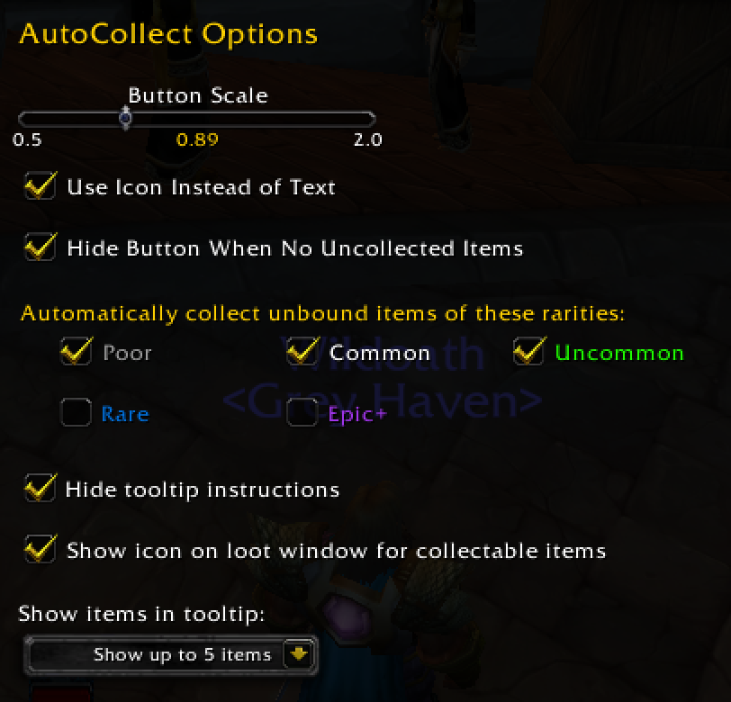
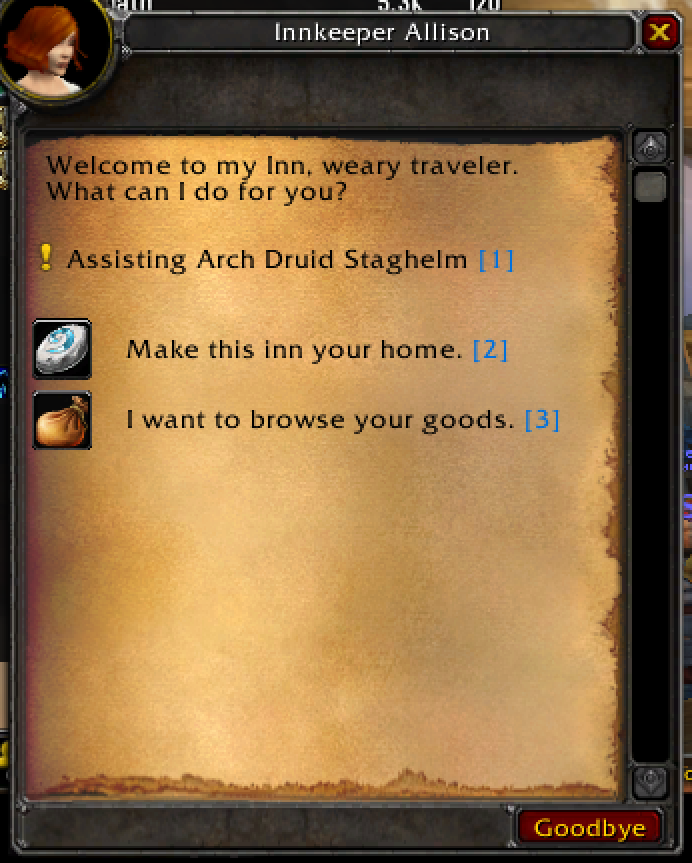

# WoW Addons for Ascension

Collection of quality-of-life addons for Ascension WoW (3.3.5 WotLK).

---

## 📦 Available Addons

### [AutoCollect](AutoCollect)
One-click transmog collection with smart filtering and visual indicators.

- Icon overlays on quest rewards and loot window
- Bind protection to prevent accidental BoE binding based on rarity
- Icon or text mode with live appearance counter

**[Download Latest](https://github.com/5tuartw/WowAddons/releases?q=autocollect&expanded=true)** · [All Releases](https://github.com/5tuartw/WowAddons/releases?q=autocollect&expanded=true)

---

### [QuestKeys](QuestKeys)
Fast quest and gossip dialogue interaction with keyboard shortcuts - no more clicking through dialogs.

- Spacebar to accept/complete quests automatically
- Number keys (1-9) for gossip options and quest rewards
- Visual key hints showing available shortcuts

**[Download Latest](https://github.com/5tuartw/WowAddons/releases?q=questkeys&expanded=true)** · [All Releases](https://github.com/5tuartw/WowAddons/releases?q=questkeys&expanded=true)

---

### [ME Stats](MEStats)
Track your Mystic Enchant collection progress with detailed statistics.

- Collection tracker for all Mystic Enchants
- Statistics by class, armor type, weapon type
- At-a-glance stats on minimap tooltip
- Color-coded completion percentages

**[Download Latest](https://github.com/5tuartw/AscAddons/releases?q=mestats&expanded=true)** · [All Releases](https://github.com/5tuartw/AscAddons/releases?q=mestats&expanded=true)

---

### [Ascension Vanity Helper](AscensionVanityHelper)
Manage and summon vanity collection items with 15 built-in heirloom sets.

- One-click heirloom set delivery
- Auto-open and cleanup features
- Supports all vanity collection items
- Customizable keybindings

**[Download Latest](https://github.com/5tuartw/AscAddons/releases?q=avh&expanded=true)** · [All Releases](https://github.com/5tuartw/AscAddons/releases?q=avh&expanded=true)

---

### [Ascension Trinket Manager](AscensionTrinketManager)
Clickable trinket buttons with auto-equip mount speed feature.

- Visual trinket buttons with cooldown displays
- Auto-equip Stick on a Carrot when mounting
- Right-click swap menu for quick changes
- Configurable layout and positioning

**[Download Latest](https://github.com/5tuartw/AscAddons/releases?q=atm&expanded=true)** · [All Releases](https://github.com/5tuartw/AscAddons/releases?q=atm&expanded=true)

---

## License

MIT License - See [LICENSE](LICENSE) for details