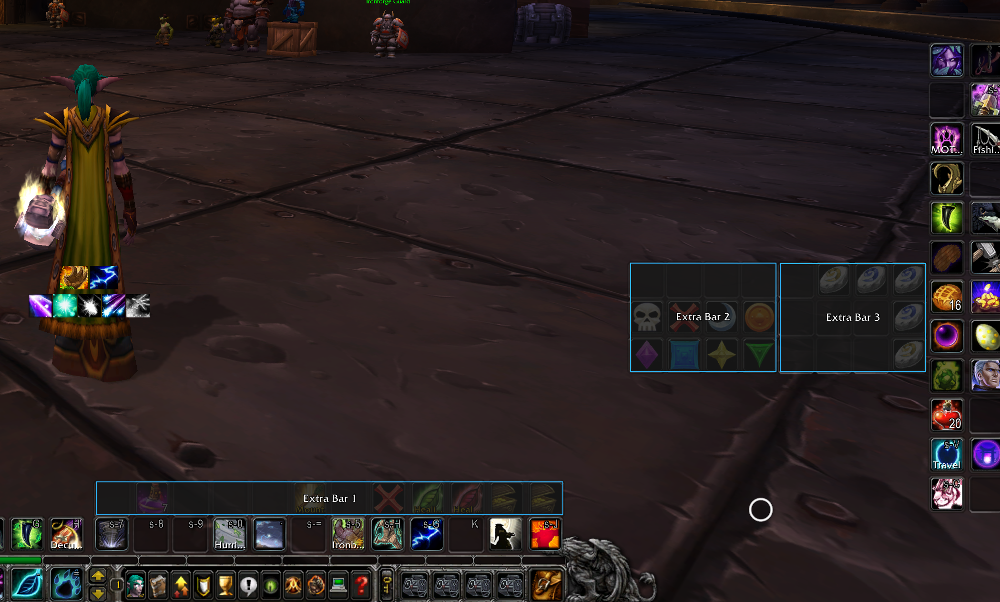

# WowAddons

Minimal home for personal Ascension WoW (3.3.5) addons and supporting tooling.

## Active Addons

### QuestKeys
Keyboard-first quest and gossip flow.

- Space to accept/complete/continue interactions
- Number keys for options and rewards
- Handles multi-page NPC option chains

- Addon: [addons/QuestKeys](addons/QuestKeys)
- Docs: [addons/QuestKeys/README.md](addons/QuestKeys/README.md)
- Releases: <https://github.com/5tuartw/WowAddons/releases?q=questkeys&expanded=true>

### ExtraBarsAscension
Three extra configurable action bars using default UI pages.

- Supports per-bar layout, size, spacing, visibility, and paging
- Includes stance-page suppression mode for claimed pages
- Keeps default UI while expanding usable bar real estate

- Addon: [addons/ExtraBarsAscension](addons/ExtraBarsAscension)
- Docs: [addons/ExtraBarsAscension/README.md](addons/ExtraBarsAscension/README.md)

### Other Maintained Addons

- [addons/AscensionPromptSquelcher](addons/AscensionPromptSquelcher)
- [addons/AscensionTrinketManager](addons/AscensionTrinketManager)
- [addons/AscensionVanityHelper](addons/AscensionVanityHelper)
- [addons/AutoCollect](addons/AutoCollect)
- [addons/DialogueReborn](addons/DialogueReborn)
- [addons/MEStats](addons/MEStats)

## Tooling

- Canonical updater/checker: [addon_manager](addon_manager)
- Release packaging helper: [create_release.sh](create_release.sh)
- Local game deployment helper: [scripts/deploy_addons.sh](scripts/deploy_addons.sh)
- Release/tag safety guide: [.github/RELEASE_STRATEGY.md](.github/RELEASE_STRATEGY.md)
- Deferred repo layout plan: [.github/ADDONS_REORG_PLAN.md](.github/ADDONS_REORG_PLAN.md)

## Repository Notes

- Third-party and reference content may exist for compatibility and testing.
- Legacy updater entrypoint [addon_updater.py](addon_updater.py) is deprecated; use addon_manager.
