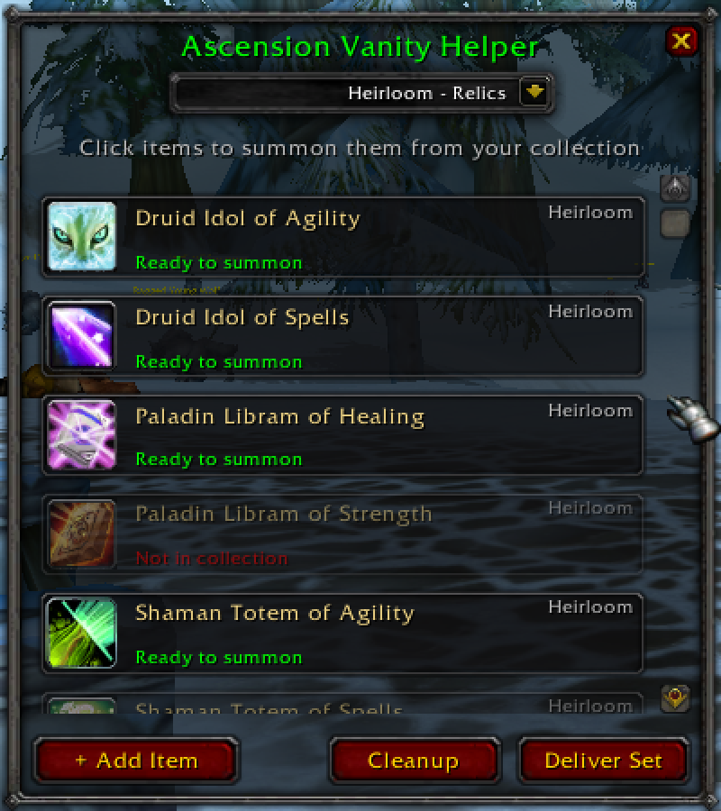

# Ascension Vanity Helper

A WoW addon for Ascension that helps you manage and summon frequently used vanity collection items across multiple characters.

[Download](https://github.com/5tuartw/AscAddons/releases)

## Features

- **15 Built-in Heirloom Sets** - Pre-configured sets for all heirloom armor, weapons, relics, and accessories
- **New Character Essentials** - Starter set with warchest, banks, travel items, and more
- **Custom Item Sets** - Create unlimited custom sets for different purposes
- **Granular Set Control** - Show/hide individual built-in sets in options
- **Quick Summon Interface** - Simple window listing all items in current set
- **One-Click Delivery** - Click any item to summon it from your collection
- **Deliver Set Button** - Get all items in a set sequentially (2-second delays)
- **Cleanup Helper** - Dedicated window to delete collected vanity items from bags
- **Openable Containers** - Special "Open" button for Warchest and Tool Dispenser Crate

## Built-in Sets

### Starter Kit
- Fel Enchanted Warchest
- Flight Master's Whistle
- Feather of the Ancients: Azeroth
- Travel Permit
- Stick on a Carrot
- Personal Bank
- Realm Bank
- Ethereal Tool Dispenser Crate
- Gnomish Portable Post Tube

### Heirloom Sets (14 categories)
- **Cloth Int+Hit** - Tattered Dreadmist (9 pieces)
- **Leather Agility** - Stained Shadowcraft (9 pieces)
- **Leather Int+Spi** - Preened Ironfeather (9 pieces)
- **Leather Agi+Int** - Champion Herod's (9 pieces)
- **Leather Int+Mp5** - Mystical Elements (9 pieces)
- **Mail Strength** - Polished Valor (9 pieces)
- **Mail Defense** - Burnished Might (9 pieces)
- **PvP Armor** - Heirloom shoulder pieces + insignias (9 pieces)
- **Physical Dmg Weapons** - Melee weapons, bows, shields (12 items)
- **Spellpower Weapons** - Caster weapons and off-hands (4 items)
- **PvP Weapons** - PvP-focused weapons (5 items)
- **Relics** - Druid idols, Paladin librams, Shaman totems (6 items)
- **Misc** - Rings, necklaces, trinkets (11 items)

(Gif below sped up x3)

**Total: 115 items across all built-in sets**

## Installation

1. Download the latest release ZIP from [Releases](https://github.com/5tuartw/AscAddons/releases)
2. Extract the `AscensionVanityHelper` folder to:
   - `World of Warcraft/Interface/AddOns/`
3. Restart WoW or `/reload` if already in-game
4. Type `/avh` to open the addon

## Usage

### Commands
- `/avh` or `/vanityhelper` - Toggle the main window
- `/avh show` - Show the window
- `/avh hide` - Hide the window
- `/avh cleanup` - Open cleanup helper to delete collected items
- `/avh auto` - Toggle auto-show on login
- `/avh debug` - Toggle debug mode
- `/avh add <itemID>` - Add item to current set
- `/avh remove <itemID>` - Remove item from current set
- `/avh create <name>` - Create a new custom set
- `/avh delete <name>` - Delete a custom set
- `/avh reset` - Reset current set to defaults
- `/avh help` - Display command help

### Managing Sets
1. **Switch Sets** - Click the dropdown at the top to select a different set
2. **Create New Set** - Click dropdown → "+ Create New Set" or use `/avh create My Tank Set`
3. **Delete Custom Set** - Switch to the set, then click dropdown → "Delete Current Set"
4. **Add Items to Set** - Click "+ Add Item" button or use `/avh add 657112`
5. **Remove Items** - Use `/avh remove 657112` to remove an item from current set
6. **Show/Hide Built-in Sets** - Open ESC → Interface → Addons → Ascension Vanity Helper

### Basic useage
1. Type `/avh` to open the window
2. Select your desired set from the dropdown (default: "New Character")
3. Click any item to summon it from your collection
4. Click "Deliver Set" to summon all items sequentially (2-second delays between summons)
5. Use "+ Add Item" to add more items to customise a set

### Cleanup Helper
1. Type `/avh cleanup` or click "Cleanup" button in main window
2. View all collected vanity items in your bags
3. Click "Delete" on any item to permanently remove it with no popups
4. Special items shown even if not collected:
   - Ethereal Tool Dispenser (extract upgrades first!)
   - Pitlord's Satchel

### Openable Containers
Some items have an "Open" button that summons and opens them:
- **Fel Enchanted Warchest** (657112)
- **Ethereal Tool Dispenser Crate** (8263511)

## Technical Details

- **WoW Version**: 3.3.5 (WotLK)
- **Server**: Ascension WoW
- **Interface**: 30300
- **SavedVariables**: `AscensionVanityHelperDB`
- **Dependencies**: None (standalone addon)

## Known Issues

- Item names may not load immediately on first login (cache warming). Browse sets once to populate names.
- Unique items cannot be summoned if already equipped (prevents duplicate error)

## Feedback
Please let me know if there are any items that you think should be included in the built-in sets!

- **Issues**: [GitHub Issues](https://github.com/5tuartw/WowAddons/issues)

## License

MIT License - See [LICENSE](../LICENSE) for details.

## Changelog

### v0.1.0 (2025-11-09)
- Added 14 heirloom sets (115 total items)
- Added per-set visibility toggles in options
- Renamed "Batch Summon" to "Deliver Set"
- Reordered dropdown: New Character first, then heirlooms by category
- Added Ethereal Tool Dispenser Crate as openable container
- Improved cleanup helper with special item handling
- Fixed grid alignment in cleanup window
- Removed redundant warchest helper
- Cleaned up chat message spam
- Core functionality: summon vanity items
- Custom set management
- Warchest integration
- Cleanup helper
- Minimap button

