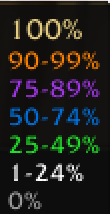

# ME Stats

Track your Mystic Enchant collection progress across all quality tiers and class specializations.

<table>
<tr>
<td width="60%">

</td>
<td width="40%">

</td>
</tr>
<tr>
<td align="center"><em>Main statistics panel</em></td>
<td align="center"><em>Color-coded progress key</em></td>
</tr>
</table>

[Download](https://github.com/5tuartw/AscAddons/releases)

## Features

- **Minimap Button**: Quick access to your statistics panel
- **Quality Breakdown**: See collection progress by Rare, Epic, Legendary, and Artifact tiers
- **Class Statistics**: Track which classes you've collected for each quality level
- **Percentage Mode**: Toggle between count view (577/1064) and percentage view (54.2%)
- **Color-Coded Progress**: Visual feedback with color gradients
  - 100% = Pale Gold
  - 90-99% = Orange
  - 75-89% = Purple
  - 50-74% = Blue
  - 25-49% = Green
  - 1-24% = Dark Grey
  - 0% = Grey

## Usage

1. **Open Panel**: Click the minimap button
2. **View Statistics**: See your collection organized by quality (rows) and class (columns)
3. **Toggle Percentage**: Check the `%` box in the bottom-right to switch to percentage view
4. **Color Key**: Hover over the `%` label to see the color coding legend

## Installation

Download the latest release ZIP from [Releases](https://github.com/5tuartw/AscAddons/releases) and copy the `MEStats` folder to:
```
<Ascension Install>/Interface/AddOns/MEStats/
```

## Settings

Settings are saved per-account in `SavedVariables/MEStatsDB.lua`:
- Minimap button position (drag to reposition)
- Percentage mode preference

## Technical Details

**Version**: 1.0.0  
**Interface**: 30300 (WotLK 3.3.5a)  
**Dependencies**: None  
**API Used**: `C_MysticEnchant` (Ascension-specific)

## Support

This addon is designed specifically for **Ascension WoW**. It uses Ascension's custom `C_MysticEnchant` API and will not work on retail WoW or other private servers.

For issues or feature requests, visit the [main repository](../../../issues).
